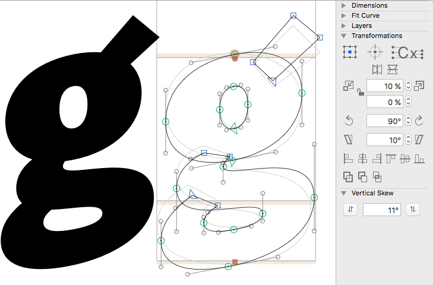

# VerticalSkew.glyphsFilter

This is a plugin for the [Glyphs font editor](http://glyphsapp.com/) by Georg Seifert.
It will shear your selection vertically. After installation, it will add the Palette item *Vertical Skew*.

### Installation

1. Go to *Window > Plugin Manager.*
2. Click on the *Install* button next to *VerticalSkew.*
3. Restart the app.

### Usage Instructions

1. Select a glyph in Edit view, or select any number of glyphs in Font or Edit View. Or make a selection in the current glyph.
2. Type a degree value in the angle field of the *Vertical Skew* palette.
3. Set a transformation origin in the *Transformations* palette.
4. Click on the button ⥯ or ⥮ in the *Vertical Skew* palette.

### Requirements

The plugin has only been tested for Glyphs 2.4.x on macOS Sierra. It may not work on older configurations.

### License

Copyright 2017 Rainer Erich Scheichelbauer (@mekkablue), idea by Luisa Baeta and Matteo Bologna.
Based on sample code by Georg Seifert (@schriftgestalt) and Jan Gerner (@yanone).

Licensed under the Apache License, Version 2.0 (the "License");
you may not use this file except in compliance with the License.
You may obtain a copy of the License at

http://www.apache.org/licenses/LICENSE-2.0

See the License file included in this repository for further details.
